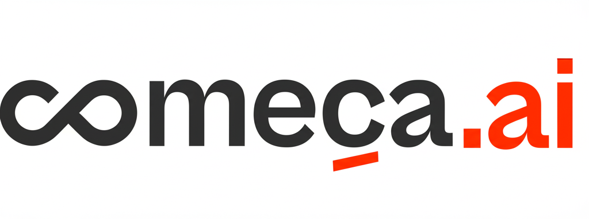

# 🧠 Começa AI - Meu Prompt

Uma extensão do Chrome poderosa e elegante para gerenciar seus prompts de IA favoritos. Organize, pesquise e acesse rapidamente seus prompts para ChatGPT, Gemini AI, Claude e outras ferramentas de IA.



## ✨ Funcionalidades

### 🗂️ **Organização Inteligente**
- **Pastas personalizadas**: Organize seus prompts por categoria ou projeto
- **Sistema de favoritos**: Marque seus prompts mais utilizados
- **Tags inteligentes**: Adicione tags para facilitar a busca
- **Categorias predefinidas**: Escrita, Código, Marketing, Educação, Negócios e mais

### 🔍 **Busca Avançada**
- **Pesquisa em tempo real**: Encontre prompts pelo título, conteúdo ou tags
- **Filtros por pasta**: Visualize prompts de uma pasta específica
- **Filtros por categoria**: Organize por tipo de uso

### 📋 **Cópia com Um Clique**
- **Cópia instantânea**: Copie qualquer prompt para a área de transferência
- **Notificações visuais**: Feedback imediato das ações realizadas
- **Histórico de uso**: Acesso rápido aos prompts mais usados

### 🛒 **Marketplace de Prompts**
- **Biblioteca pública**: Acesse prompts prontos criados pela comunidade
- **Importação fácil**: Adicione prompts do marketplace à sua coleção
- **Categorias diversas**: Prompts para diferentes necessidades

### ⚡ **Atalhos e Automação**
- **Atalhos de teclado**: Acesso rápido via `Ctrl+Shift+P`
- **Detecção automática**: Reconhece sites de IA populares
- **Botão flutuante**: Acesso rápido em sites de IA
- **Inserção automática**: Cola prompts diretamente nos campos de texto

### 🎨 **Interface Moderna**
- **Design responsivo**: Funciona perfeitamente em qualquer tamanho de tela
- **Tema elegante**: Interface limpa e profissional
- **Animações suaves**: Experiência de usuário fluida
- **Acessibilidade**: Suporte completo a leitores de tela

## 🚀 Instalação

### Método 1: Chrome Web Store (Recomendado)
*Em breve disponível na Chrome Web Store*

### Método 2: Instalação Manual

1. **Download dos arquivos**
   ```bash
   git clone https://github.com/comeca-ai/comecai_prompt.git
   # ou baixe o ZIP e extraia
   ```

2. **Abrir Chrome Extensions**
   - Acesse `chrome://extensions/` no seu navegador
   - Ou vá em Menu → Mais ferramentas → Extensões

3. **Ativar Modo Desenvolvedor**
   - Clique no switch "Modo do desenvolvedor" no canto superior direito

4. **Carregar extensão**
   - Clique em "Carregar sem compactação"
   - Selecione a pasta onde extraiu os arquivos da extensão

5. **Pronto!** 🎉
   - A extensão aparecerá na barra do Chrome
   - Clique no ícone para começar a usar

## 📚 Como Usar

### Primeiros Passos

1. **Primeiro acesso**: Clique no ícone da extensão na barra do Chrome
2. **Prompt de boas-vindas**: Um prompt de exemplo será criado automaticamente
3. **Crie seu primeiro prompt**: Clique em "Novo Prompt" e preencha as informações

### Gerenciando Prompts

#### ➕ **Criar Novo Prompt**
1. Clique em "Novo Prompt" na barra lateral
2. Preencha os campos:
   - **Título**: Nome descritivo do prompt
   - **Categoria**: Tipo de uso (Escrita, Código, etc.)
   - **Pasta**: Organização (cria novas pastas se necessário)
   - **Conteúdo**: O texto do prompt em si
   - **Tags**: Palavras-chave separadas por vírgula
3. Clique em "Salvar Prompt"

#### ✏️ **Editar Prompt**
1. Clique no ícone de edição (✏️) no card do prompt
2. Modifique as informações desejadas
3. Salve as alterações

#### 📋 **Copiar Prompt**
1. Clique no ícone de cópia (📋) no card do prompt
2. O texto será copiado automaticamente
3. Cole onde precisar com `Ctrl+V`

#### ⭐ **Favoritar Prompt**
1. Clique no ícone de estrela (⭐) no card do prompt
2. Prompts favoritados aparecem na pasta "Favoritos"

### Organizando com Pastas

#### 📁 **Criar Nova Pasta**
1. Clique no ícone "+" ao lado de "Pastas"
2. Digite o nome da nova pasta
3. Clique em "Criar Pasta"

#### 🗑️ **Excluir Pasta**
1. Clique no ícone de lixeira ao lado do nome da pasta
2. Confirme a exclusão
3. Os prompts serão movidos para "Todos os prompts"

### Marketplace

#### 🛒 **Acessar Marketplace**
1. Clique no ícone de loja (🛒) no cabeçalho
2. Navegue pelos prompts disponíveis
3. Use filtros por categoria para encontrar o que precisa

#### ⬇️ **Importar Prompt**
1. No marketplace, clique no ícone de download (⬇️)
2. O prompt será adicionado automaticamente à sua coleção
3. Você pode editá-lo após a importação

### Atalhos de Teclado

| Atalho | Função |
|--------|--------|
| `Ctrl+Shift+P` | Abrir extensão |
| `Ctrl+Shift+V` | Copiar último prompt usado |

*No Mac, use `Cmd` ao invés de `Ctrl`*

## 🌐 Sites Suportados

A extensão detecta automaticamente e oferece funcionalidades especiais nos seguintes sites:

- **ChatGPT** (chat.openai.com)
- **Gemini AI** (gemini.google.com)
- **Claude** (claude.ai)
- **Bing Chat** (bing.com/chat)
- **Bard** (bard.google.com)
- **Character.AI** (character.ai)
- **Replika** (replika.ai)

### Funcionalidades em Sites de IA:
- 🎯 **Botão flutuante**: Aparece temporariamente para acesso rápido
- 📝 **Inserção automática**: Cola prompts diretamente no campo de texto
- 🔔 **Notificações**: Aviso quando a extensão está disponível

## ⚙️ Configurações Avançadas

### Backup e Sincronização
- **Backup automático**: Os dados são salvos localmente no Chrome
- **Exportação**: Em breve - função para exportar todos os prompts
- **Importação**: Em breve - função para importar prompts de arquivos

### Personalização
- **Temas**: Interface adaptativa com tema claro
- **Atalhos**: Personalize os atalhos de teclado nas configurações do Chrome
- **Notificações**: Configure nas configurações do Chrome se desejar

## 🛠️ Desenvolvimento

### Estrutura do Projeto
```
comecai_prompt/
├── manifest.json          # Configurações da extensão
├── popup.html             # Interface principal
├── popup.js               # Lógica da aplicação
├── styles.css             # Estilos da interface
├── background.js          # Service worker
├── content.js             # Script de conteúdo
├── icons/                 # Ícones da extensão
│   ├── icon16.png
│   ├── icon48.png
│   └── icon128.png
└── README.md             # Este arquivo
```

### Tecnologias Utilizadas
- **HTML5**: Estrutura da interface
- **CSS3**: Estilos modernos com gradientes e animações
- **JavaScript ES6+**: Lógica da aplicação
- **Chrome Extensions API**: Integração com o navegador
- **Chrome Storage API**: Armazenamento local
- **Font Awesome**: Ícones da interface

### Contribuindo

1. Fork o repositório
2. Crie uma branch para sua feature (`git checkout -b feature/MinhaFeature`)
3. Commit suas mudanças (`git commit -m 'Adiciona MinhaFeature'`)
4. Push para a branch (`git push origin feature/MinhaFeature`)
5. Abra um Pull Request

## 📄 Licença

Este projeto está licenciado sob a Licença MIT - veja o arquivo [LICENSE](LICENSE) para detalhes.

## 🤝 Suporte

### Problemas Comuns

**Q: A extensão não aparece na barra do Chrome**
R: Verifique se ela está ativada em `chrome://extensions/` e se o ícone não está oculto no menu de extensões.

**Q: Os prompts não são salvos**
R: Verifique se o Chrome tem permissão para armazenar dados localmente.

**Q: A extensão não funciona em um site específico**
R: Alguns sites podem ter restrições de segurança. Tente recarregar a página.

**Q: Como posso fazer backup dos meus prompts?**
R: Atualmente os dados ficam salvos localmente no Chrome. Uma função de exportação será adicionada em breve.

### Reportar Bugs

Se encontrou um problema, por favor:
1. Verifique se não é um problema conhecido listado acima
2. Abra uma [issue no GitHub](https://github.com/comeca-ai/comecai_prompt/issues)
3. Inclua detalhes sobre o problema e como reproduzi-lo

### Solicitar Funcionalidades

Tem uma ideia para melhorar a extensão? Abra uma issue com a tag "enhancement" e descreva sua sugestão!

## 📞 Contato

- **Website**: [começa.ai](https://começa.ai)
- **Email**: contato@começa.ai
- **GitHub**: [comeca-ai](https://github.com/comeca-ai)

---

<div align="center">

**Desenvolvido com ❤️ pela equipe Começa AI**

*Transformando a forma como você usa a Inteligência Artificial*

</div>
